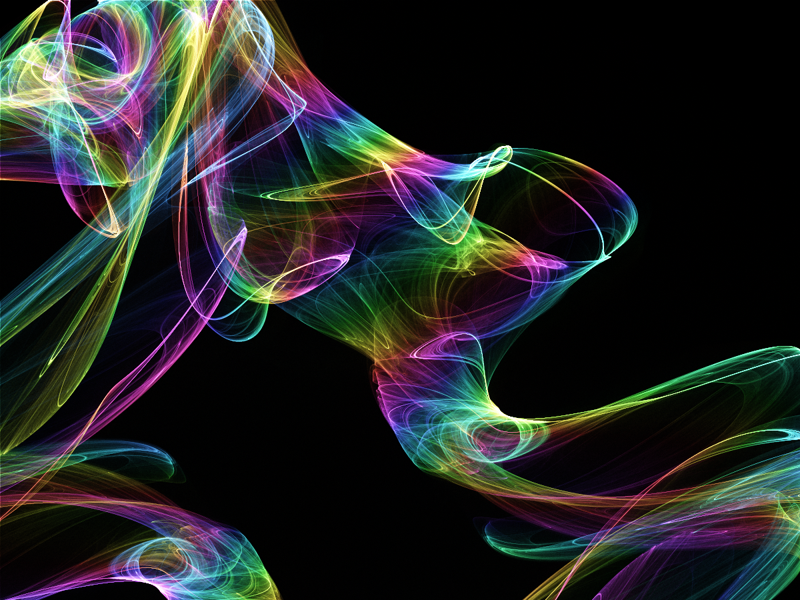
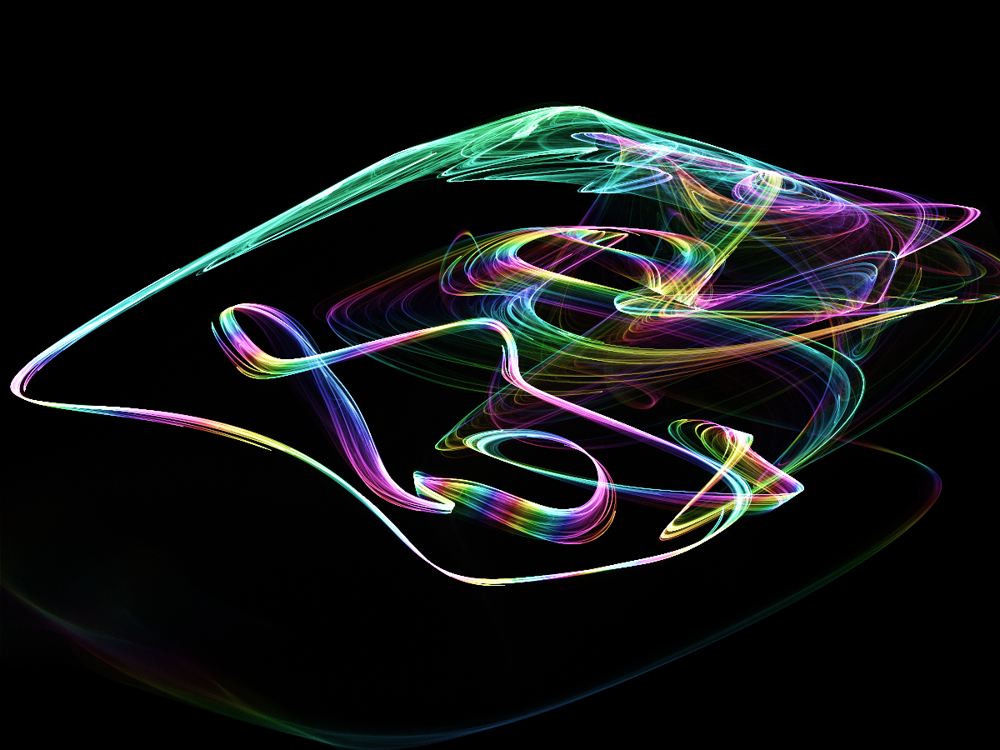
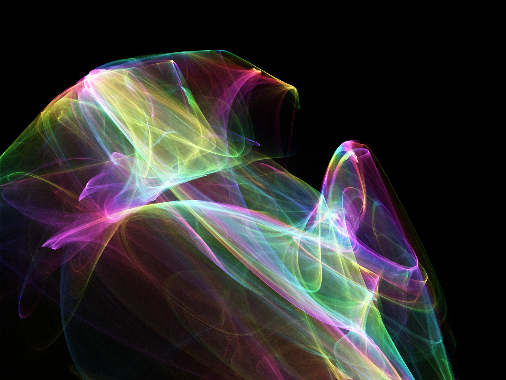

# Attractors
## What are they?

> An attractor is a set of numerical values toward which a system tends to evolve, for a wide variety of starting conditions of the system ([From Wikipedia, the free encyclopedia](https://en.wikipedia.org/wiki/Attractor))

... whatever that means. An attractor is this really pretty thing you get if you move points around in interesting ways and keep track of where the points go by drawing something:

I think it's pretty, at least.

This one was produced in the following way:
- A random 4-dimensional point was chosen (I know it might sound confusing. Just think of it as 4 numbers)
- The point was transformed in some way, moving it to a different spot (the four numbers changed to something else).
- The resulting point was drawn on the "canvas", according to what the numbers were. The first number (dimension) determined where the spot will be positioned on the x-axis. The second number determined the y-axis location. The third number determined the hue of the point. The fourth number was ignored.
- This process was repeated 420000000 times (the first step was only executed every 500th time)

As you can see, the points didn't end up being drawn everywhere. Some locations had more "drawing" than others. This was what formed the lines and shapes.

## What is this?
This project is a tool I made so that I could play with attractors. It lets you control how the points are transformed according to certain pre-set equations. These "transformations" can be adjusted with parameters. As you adjust the parameters, you get a live preview of what the attractor looks like:

## Examples

## Technical details
- The GUI is written in javafx.
- Rendering is progressive, so a change the user makes is instantly reflected by a quick and noisy render, which is subsequently continuously improved.
- Most of the important methods are documented in the code

Created by Reinis Mazeiks, with a bunch of help from the internet. 